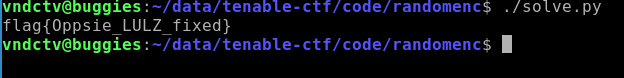

# code/random-encryption-fixed
The first challenge that I liked the looks of right of the bat was a challenge in the `code` category called `random-encryption-fixed`.
Note the name `-fixed`. The flag was left in the source when the challenge was first posted, so it's effectively the same challenge.

We were presented with an encryption routine of sorts, and the resulting output of the program, and were tasked to reverse the encryption.

## Encryption routine
```python
import random
flag = "flag{n0t_that_r4ndom}"
seeds = []
for i in range(0,len(flag)):
    seeds.append(random.randint(0,10000))

res = []
for i in range(0, len(flag)):
    random.seed(seeds[i])
    rands = []
    for j in range(0,4):
        rands.append(random.randint(0,255))

    res.append(ord(flag[i]) ^ rands[i%4])
    del rands[i%4]
    print(str(rands))

print(res)
print(seeds)
```

## Output sample
```
[249, 182, 79]
[136, 198, 95]
[159, 167, 6]
...
[184, 161, 235, 97, 140, 111, 84, 182, 162, 135, 76, 10, 69, 246, 195, 152, 133, 88, 229, 104, 111, 22, 39]
```

This extremely weak encryption routine is relatively straight forward in its operations:

1. Generate a random integer between 0 and 10000 inclusive for each character in the flag
2. Use this random integer to act as a seed to generate four random integers between 0 and 255 inclusive for each character of the flag.
3. Loop through the flag, XORing each character with one of its four random integers and add it to the final ciphertext.
4. Remove the randomly generated byte from the list.
5. Print the unused random XOR keys.

At the end of the routine it prints the resulting byte values, and along the way it was nice enough to print out the unused key bytes.

As the initial seeding is such a small set of possibilities (10,001) it is no trouble for us to precompute all the of the possible seeds, and all of the resulting key quads. At that point, we can slide through each set of quads, while searching against our known data.

```python
#!/usr/bin/python3

import random

CIPHERTEXT = [184, 161, 235, 97, 140, 111, 84, 182, 162, 135, 76, 10, 69, 246, 195, 152, 133, 88, 229, 104, 111, 22, 39]
CIPHERSEED = []
COMPUTEDSEEDS = []

def load_seeds():
    CIPHERSEED.append([249, 182, 79])
    CIPHERSEED.append([136, 198, 95])
    CIPHERSEED.append([159, 167, 6])
    CIPHERSEED.append([223, 136, 101])
    CIPHERSEED.append([66, 27, 77])
    CIPHERSEED.append([213, 234, 239])
    CIPHERSEED.append([25, 36, 53])
    CIPHERSEED.append([89, 113, 149])
    CIPHERSEED.append([65, 127, 119])
    CIPHERSEED.append([50, 63, 147])
    CIPHERSEED.append([204, 189, 228])
    CIPHERSEED.append([228, 229, 4])
    CIPHERSEED.append([64, 12, 191])
    CIPHERSEED.append([65, 176, 96])
    CIPHERSEED.append([185, 52, 207])
    CIPHERSEED.append([37, 24, 110])
    CIPHERSEED.append([62, 213, 244])
    CIPHERSEED.append([141, 59, 81])
    CIPHERSEED.append([166, 50, 189])
    CIPHERSEED.append([228, 5, 16])
    CIPHERSEED.append([59, 42, 251])
    CIPHERSEED.append([180, 239, 144])
    CIPHERSEED.append([13, 209, 132])

def solve():
    flag = ''
    for char in CIPHERSEED:
        for i in range(0,255):
            for j in range(0,4):
                # get copy
                test = list(char)
                # insert char at j
                test.insert(j, i)
                # check against COMPUTEDSEEDS
                if test in COMPUTEDSEEDS:
                    flag += chr(i ^ CIPHERTEXT[CIPHERSEED.index(char)])
                    break

    print(flag)


def compute_seeds():
    for i in range(0, 10000):
        random.seed(i)        
        rand_quad = []
        
        for j in range(0, 4):
            rand_quad.append(random.randint(0,255))

        COMPUTEDSEEDS.append(rand_quad)

if __name__ == '__main__':
    load_seeds()
    compute_seeds()
    solve()
```

And as my French friends would say, *voila!!!*


