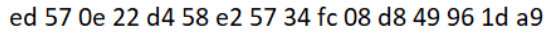
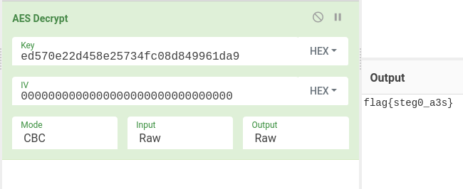

# stego/a3s-turtles
We were presented with a password protected zip file called `turtles128.zip`. Once my teammate figured out
the password to the first zip file was '0', we found that it contained another password protected zip file
called `turtles127.zip`. rabbit_ worked through a few of the next zip files and determined the passwords were
all either '0' or '1'.

I threw together a Python script that made use of `try` and `except` to loop through unzipping all the files
while at the same time outputting the bit:

```python
#!/usr/bin/python3

from zipfile import *

def main():
    bits = []
    i = 128

    while i > 0:
        with ZipFile('turtles' + str(i) + '.zip') as zip:
            try:
                zip.extractall(pwd=b'0')
                print('0')
            except:
                zip.extractall(pwd=b'1')
                print('1')
        i -= 1

if __name__ == '__main__':
    main()
```

Once all the zip files were extracted, we were left with the binary string
`00111101110010010000011011110110100100101000111011101000100000101100110010110001101110001011110111010001010010101010001001001100`
and a file called `key.png`:



As you can see, the bytes in the file `key.png` certainly are not ASCII, so we obviously knew there was a bit more
to do. Since both the key and the bit string were of equal length, I tried a quick XOR to no avail. That's when
rabbit_ pointed out the challenge name: `A3S Turtles`. Bingo! As it turns out, the bytes in `key.png` were indeed
the decryption key for the binary sequence uncovered during the unzipping process!


